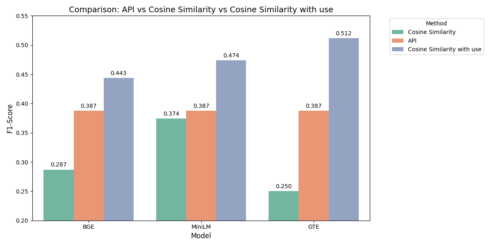

# Knowledge Graph Creation from Text with LLMs
A robust system for automatically constructing knowledge graphs from unstructured text using advanced NLP techniques and Wikidata integration.

The project was part of the **Practical Course: Data Engineering**.

**README IS NOT FINISHED YET**

## Overview 📝

This project implements an end-to-end pipeline for:
1. Extracting content from web pages
2. Generating semantic triples using language models
3. Integrating generated triples with Wikidata ontology
4. Creating a queryable knowledge graph

## Performance Highlights 📊

Our system outperforms the standard Wikidata API in property matching:


## Project Structure 📂
```
src/
├── core/                   # Core pipeline components
│   ├── Extractor/         # Web content extraction
│   ├── Generator/         # Triple generation using LLMs
│   └── Integrator/        # Knowledge graph integration
├── utils/                 # Utility functions
├── config/                # Configuration files
└── data/                  # Data processing directories
```

## Key Features ✨

- **Flexible Content Extraction**: 
  - Configurable text chunking and preprocessing
  - Automatic reference removal
  - Smart text segmentation

- **Advanced Triple Generation**: 
  - Support for various language models (Phi-3.5, GPT-3.5, etc.)
  - Customizable generation parameters
  - Batch processing capability

- **Smart Property Matching**: 
  - Semantic similarity matching
  - Alias handling
  - Multiple matching strategies (API, Cosine Similarity, Mixed)
  - Configurable matching thresholds

- **Efficient Graph Management**: 
  - RDF-based storage and querying
  - Graph visualization capabilities
  - Statistical analysis tools

## Configuration 🔧

The system is highly configurable through YAML files. Key configuration sections:

```yaml
data_paths:
  processed_data_path: "./data/run/processed"
  triples_path: "./data/run/triples"
  knowledge_graph_path: "./data/run/knowledge_graph"

extractor:
  chunk_size: 400  # Adjustable chunk size for text processing

llm:
  model_name: "microsoft/Phi-3.5-mini-instruct"
  temperature: 0.1
  max_new_tokens: 512

integrator:
  embedding_model: "sentence-transformers/all-mpnet-base-v2"
  matching_method:
    property_query_method: "api"  # Options: api, cos_similarity, mixed
```

## Installation 🚀

1. Clone the repository
```bash
git clone https://github.com/abraxas-dev/Knowledge-Graph-Creation-from-Text-with-LLMs.git
```

2. Navigate to the project directory
```bash
cd ./Knowledge-Graph-Creation-from-Text-with-LLMs
```

3. Create a virtual environment
```bash
python -m venv venv
source venv/bin/activate
```

4. Install the dependencies
```bash
pip install -r requirements.txt
```

## Usage 💡

### Basic Usage

Run the complete pipeline:
```bash
python run.py --config config/main.yaml --mode full
```

### Pipeline Modes

The system supports different execution modes:
- `full`: Run the complete pipeline
- `extract`: Only run content extraction
- `generate`: Only run triple generation
- `integrate`: Only run knowledge graph integration

Example:
```bash
# Run only the extraction phase
python run.py --config config/main.yaml --mode extract

# Run only triple generation
python run.py --config config/main.yaml --mode generate
```

### Visualization

The system includes built-in visualization capabilities:
```python
from src.core.Integrator import GraphManager

# Load and visualize the graph
graph_manager = GraphManager()
graph_manager.load_graph("path/to/your/graph.ttl")
graph_manager.visualize(output_dir="./visualizations")
```

## Requirements 📋

- Python 3.8+
- See `requirements.txt` for complete list of dependencies

## Developers 👨‍💻

**Didarbek Baidaliyev - abraxas-dev**
- System Architect
- Developed Integrator, Generator & Evaluator
- Data Analysis
- Documentation and testing

**Ar Pazari - paza15**
- Developed Extractor & Metrics
- Data Preparer

**Samuel Garcia - https://github.com/Sondeluz**
- Thanks to our supervisor for his guidance and support throughout the project :)


